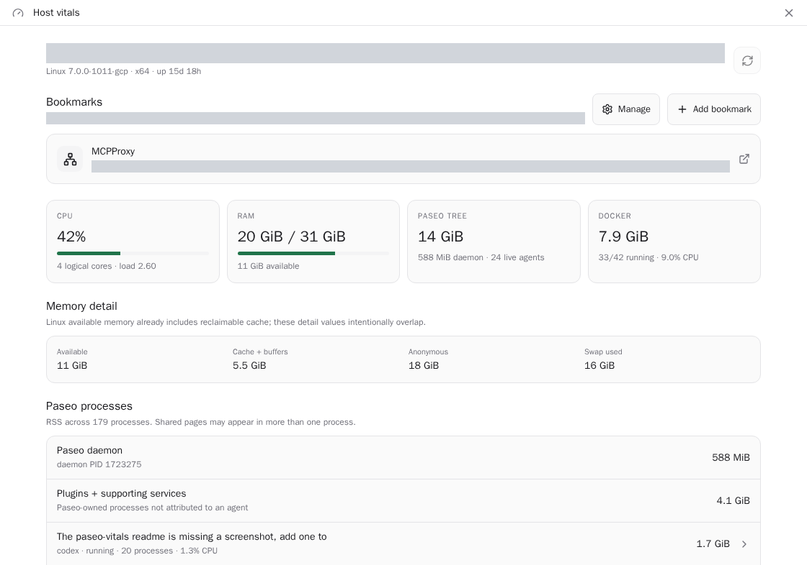

# paseo-vitals

[](https://www.npmjs.com/package/paseo-vitals)
[](https://www.npmjs.com/package/paseo-vitals)
[](https://paseo.sh)
[](LICENSE)

A small Paseo sidebar dashboard for answering one question: how is this development VM doing?



Live usage on a Linux Paseo host. Private host addresses are redacted.

It shows:

- host CPU, load, uptime, RAM detail, swap, and root-disk usage;
- Paseo daemon/plugin RSS separately from agent process trees;
- per-agent RSS, CPU, process count, provider, and status;
- Docker container CPU, cgroup memory, state, PIDs, network I/O, and block I/O;
- the host's largest processes by RSS.

The plugin reads Linux `/proc` directly and invokes `docker stats` at most once per cached refresh.
It reads only the `PASEO_AGENT_ID` environment entry needed to attribute a process tree; command
lines and other process environment values are never returned to the client.

## Install

Install from npm on Paseo 0.9.0 or newer:

```sh
paseo plugin install npm:paseo-vitals
```

Paseo 0.8 can install the same plugin from Git:

```sh
paseo plugin add tomgrin10/paseo-vitals
```

For local development:

```sh
npm ci
npm run verify
paseo plugin install "$PWD"
```

Open **Host vitals** from Paseo's sidebar. The dashboard refreshes every five seconds while mounted.
Docker failure is non-fatal, and process-level detail degrades gracefully on non-Linux hosts.

## More Paseo plugins

Also available from [Tom Gringauz](https://github.com/tomgrin10):

- [Defer](https://www.npmjs.com/package/paseo-defer) — Schedule messages to agents for later delivery.
- [Graphite](https://www.npmjs.com/package/paseo-graphite) — Monitor Graphite stacks and PR action state.
- [Smart Session](https://www.npmjs.com/package/paseo-smart-session) — Context-aware compaction and usage insights for long-running agents.
